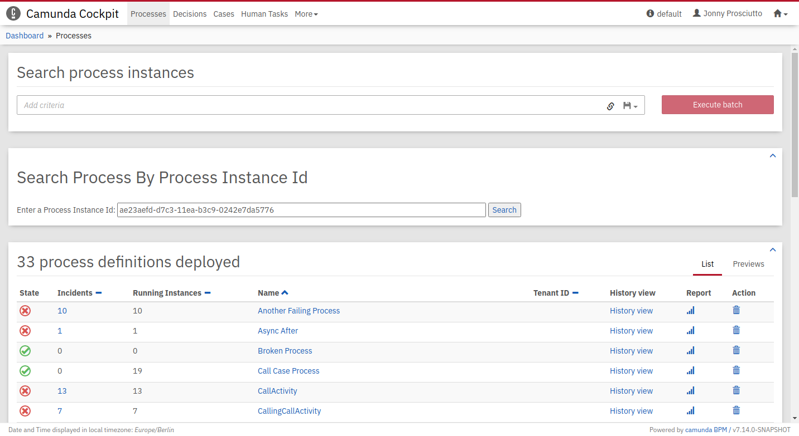

AngularJS 1.x "Search Processes" Plugin
=======================================

This is an example of how to migrate an existing angularJS Plugin to the new Plugin system. The original plugin can be found in `original-plugin.js`.

Note that `localConf` is a service that was provided by the Camunda framework and was removed. You can implement the service yourself if you desire the functionality.




Building the Project
--------------------

Install the project with `npm i` and build the plugin with `npm run build`. Your plugin will be created in `dist/angularJsPlugin.js`.

Integrate into Camunda Webapp
-----------------------------

Copy the `angularJsPlugin.js` file into the `app/cockpit/scripts/` folder in your Camunda webapp distribution.
For the Tomcat distribution, this would be `server/apache-tomcat-X.X.XX/webapps/camunda/app/cockpit/scripts/`.

Add the following content to the `app/cockpit/scripts/config.js` file:

```
// …
  customScripts: [
    'scripts/angularJsPlugin.js'
  ]
// …
```
After that start the server, login to Cockpit and navigate to the process definition view to check the result.

License
-------

Use under terms of the [Apache License, Version 2.0](http://www.apache.org/licenses/LICENSE-2.0)