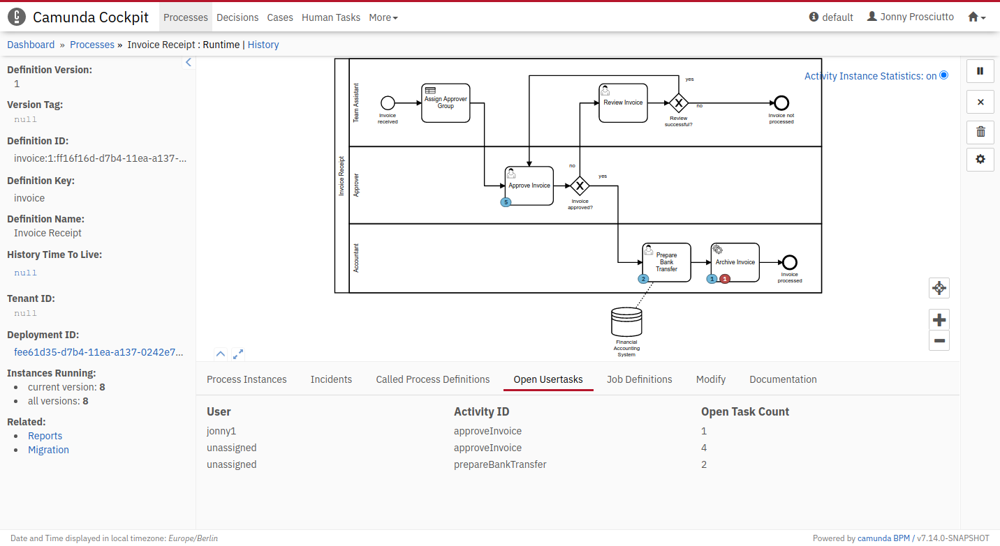

Angular 10 "Open Usertasks" Cockpit Tab
=======================================

This example shows how to develop a Cockpit plugin in Angular 10.
Click on an activity in the BPMN diagram to apply a filter to the table.

Built and tested against Camunda Platform version `7.14.0`.




Building the Project
--------------------

Install the project with `npm i` and build the plugin with `npm run buildPlugin`. Your plugin will be created in `dist/plugin.js`.

Integrate into Camunda Webapp
-----------------------------

Copy the `plugin.js` file into the `app/cockpit/scripts/` folder in your Camunda webapp distribution.
For the Tomcat distribution, this would be `server/apache-tomcat-X.X.XX/webapps/camunda/app/cockpit/scripts/`.

Add the following content to the `app/cockpit/scripts/config.js` file:

```
// …
  customScripts: [
    'scripts/plugin.js'
  ]
// …
```
After that start the server, login to cockpit and navigate to the process definition view to check the result.

License
-------

Use under terms of the [Apache License, Version 2.0](http://www.apache.org/licenses/LICENSE-2.0)
