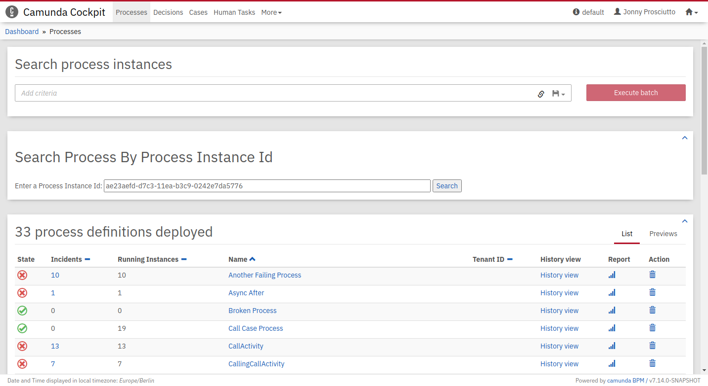

AngularJS 1.x "Search Processes" Cockpit Plugin
===============================================

This is an example of how to migrate an existing angularJS Plugin to the new Plugin system. The original plugin can be found in `original-plugin.js`.

Note that `localConf` is a service that was provided by the Camunda framework and was removed. You can implement the service yourself if you desire the functionality.



Migrating a 7.13 Plugin
-----------------------

This example shows you how to migrate a 7.13 AngularJS Plugin to the new Plugin System. You can find the 7.13 Plugin in `original-plugin.js` and the migrated version in `plugin.js`.

Let's have a look at the structure of a 7.13 plugin. We added some placeholders to make it more readable.
```javascript
// plugin.js
// A require.js callback with angular injected
define(["angular"], function(angular) {

  // A AngularJS controller with Dependency injection
  var searchProcessViewController = [/* ... */];

  // The template, related to your Controller
  var template = '...';

  // Your custom module
  var ngModule = angular.module("cockpit.searchProcess", []);

  // Injecting the 'ViewsProvider' to register a Plugin
  ngModule.config([
    "ViewsProvider",
    function(ViewsProvider) {
      // Registering the Plugin with template and controller at 'cockpit.processes.dashboard', adding labels and priority
      ViewsProvider.registerDefaultView("cockpit.processes.dashboard", {
        id: "cockpit.searchProcess",
        label: "Search Process By Process Instance Id",
        priority: 9001,
        template:  template,
        controller: searchProcessViewController
      });
    }
  ]);

  // Returns the module
  return ngModule;
});

```

The 7.14 Cockpit Plugin System is framework agnostic, so we will have to create and bootstrap our own AngularJS application. require.js was replaced with the JavaScript module system, and the plugin-point definitions are moved to the top level. Template and Controller are still present, but need to be adjusted to work in a standalone AngularJS app: 
```javascript
// plugin.js
// include AngularJS in your Plugin
import angular from "angular";

// Javascript Module syntax, using the default export to define the Plugin details
export default {
  id: "cockpit.searchProcess",
  pluginPoint: "cockpit.processes.dashboard",
  priority: 9,
  // The render function is called when the view with the plugin is loaded
  render: node => {

    // The AngularJS Controller 
    var searchProcessViewController = [/* ... */];

    // Make sure to explicitly use the controller
    var template = '<div ng-controller="searchProcessViewController">...</div>';

    // Create module and register the controller
    var ngModule = angular.module("cockpit.searchProcess", []);
    ngModule.controller(
      "searchProcessViewController",
      searchProcessViewController
    );

    // Set the template and bootstrap your application into the node
    node.innerHTML = template;
    angular.bootstrap(node, [ngModule.name]);
  },
  properties: {
    label: "Search Processes"
  }
};
```

Directives and services you used in 7.13 might no longer be available in your standalone AngularJS. To find out what you need to migrate, check out the [7.13 to 7.14 update guide](https://docs.camunda.org/manual/7.14/update/minor/713-to-714/).


Building the Project
--------------------

Install the project with `npm i` and build the plugin with `npm run build`. Your plugin will be created in `dist/plugin.js`.

Integrate into Camunda Webapp
-----------------------------

Copy the `plugin.js` file into the `app/cockpit/scripts/` folder in your Camunda webapp distribution.
For the Tomcat distribution, this would be `server/apache-tomcat-X.X.XX/webapps/camunda/app/cockpit/scripts/`.

Add the following content to the `app/cockpit/scripts/config.js` file:

```
// …
  customScripts: [
    'scripts/plugin.js'
  ]
// …
```
After that start the server, login to Cockpit and navigate to the process definition view to check the result.

License
-------

Use under terms of the [Apache License, Version 2.0](http://www.apache.org/licenses/LICENSE-2.0)
