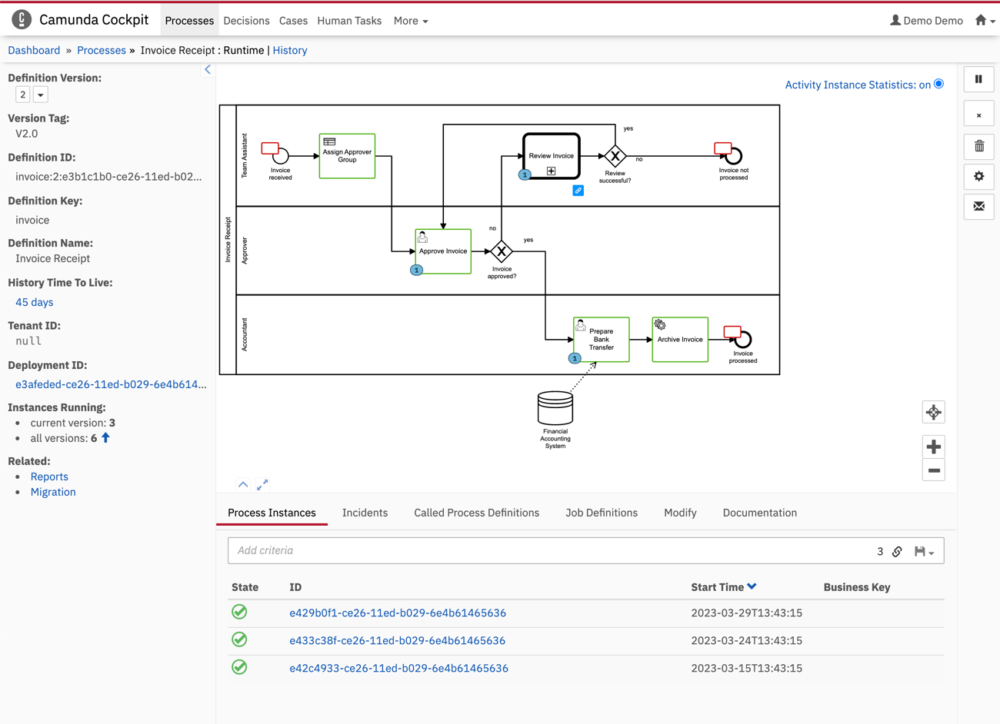

# bpmn.js Cockpit module - bundled

This example shows how to develop, bundle and include a bpmn-js custom module into Cockpit.

For additional information, please also see the [documentation](https://docs.camunda.org/manual/latest/webapps/cockpit/extend/configuration/#bpmn-diagram-viewer-bpmn-js).

Built and tested against Camunda Platform version `7.22.0`.




## Develop the custom bpmn-js module


For this example, we will implement a custom renderer, which will renderer BPMN UserTasks and Events differently.

You can find the source code in the [`custom-renderer` directory](./custom-renderer).

Implementing a custom renderer is just one of many examples how you can customize [bpmn-js](https://github.com/bpmn-io/bpmn-js) to your needs. Please visit the [bpmn-js Custom Rendering](https://github.com/bpmn-io/bpmn-js-example-custom-rendering) example to find out more about rendering and how to customize it. Please visit [awesome bpmn-js](https://github.com/bpmn-io/awesome-bpmn-io) for various other resources and projects around bpmn-js and other bpmn-io libraries.


## Bundle the custom renderer


The Cockpit WebApplication will import the additional modules during runtime in the browser. Hence, the [sources](./custom-renderer) need to be bundled so that they can be interpreted by the browser. In order to do that, we will use [rollup](https://rollupjs.org/). We will also use the [rollup-commonjs](https://github.com/rollup/plugins/tree/master/packages/commonjs) plugin to convert the sources to ES6 and the [rollup-node-resolve](https://github.com/rollup/plugins/tree/master/packages/node-resolve) plugin to include third party modules required by our custom renderer.

Our `rollup.config.js` file looks like this:
```js
import resolve from "@rollup/plugin-node-resolve";
import commonjs from "@rollup/plugin-commonjs";

export default {
  input: "custom-renderer/index.js",
  output: {
    file: "dist/custom-renderer-module-bundled.js"
  },
  plugins: [resolve(), commonjs()]
};
```

We can create the bundled `.js` file by running
```sh
$ npm run bundle
```

Note that the bundled [`custom-renderer-module-bundled.js` module](./dist/custom-renderer-module-bundled.js) is included in this repository, so you don't necessarily have to locally run all of the above steps.

## Include the bundled module in Cockpit


To include the bundled module in your Cockpit application, copy the [`custom-renderer-module-bundled.js` file](./dist/custom-renderer-module-bundled.js) into the `app/cockpit/scripts/` folder in your Camunda webapp distribution.
For the Tomcat distribution, this would be `server/apache-tomcat-X.X.XX/webapps/camunda/app/cockpit/scripts/`.

Then, add the following content to the `app/cockpit/scripts/config.js` file:

```javascript
// …
  bpmnJs: {
    additionalModules: [
      'scripts/custom-renderer-module-bundled'
    ]
  }
// …
```
After that, start the server, login to Cockpit and navigate to the Process instance view to check the result.

License
-------

Use under terms of the [Apache License, Version 2.0](http://www.apache.org/licenses/LICENSE-2.0)
