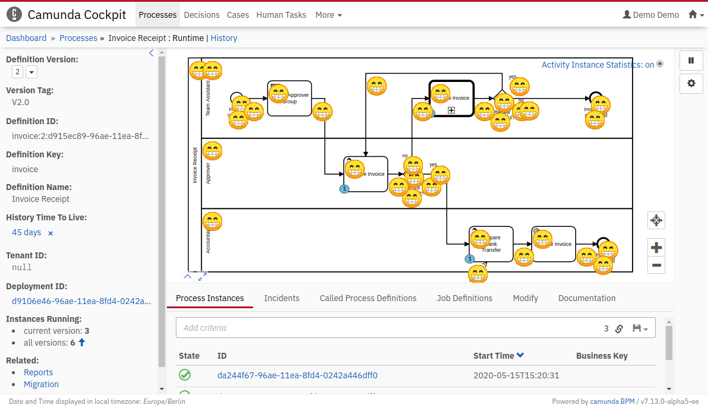

Cockpit bpmn.js module
=================================

This example shows how to develop a Cockpit bpmn.js module.

For additional information, please also see the [documentation](https://docs.camunda.org/manual/7.12/webapps/cockpit/extend/configuration/#bpmn-diagram-viewer-bpmn-js).

Built and tested against Camunda BPM version `7.12.0`.




Integrate into Camunda Webapp
-----------------------------

Copy the `bpmn-js-module.js` file into the `app/cockpit/scripts/` folder in your Camunda webapp distribution.
For the Tomcat distribution, this would be `server/apache-tomcat-X.X.XX/webapps/camunda/app/cockpit/scripts/`.

Add the following content to the `app/cockpit/scripts/config.js` file:

```
// …
bpmnJs: {
  additionalModules: {
    myCustomModule: 'scripts/bpmn-js-module'
  }
}
// …
```
After that start the server, login to cockpit and navigate to the Process instance view to check the result.

License
-------

Use under terms of the [Apache License, Version 2.0](http://www.apache.org/licenses/LICENSE-2.0)
