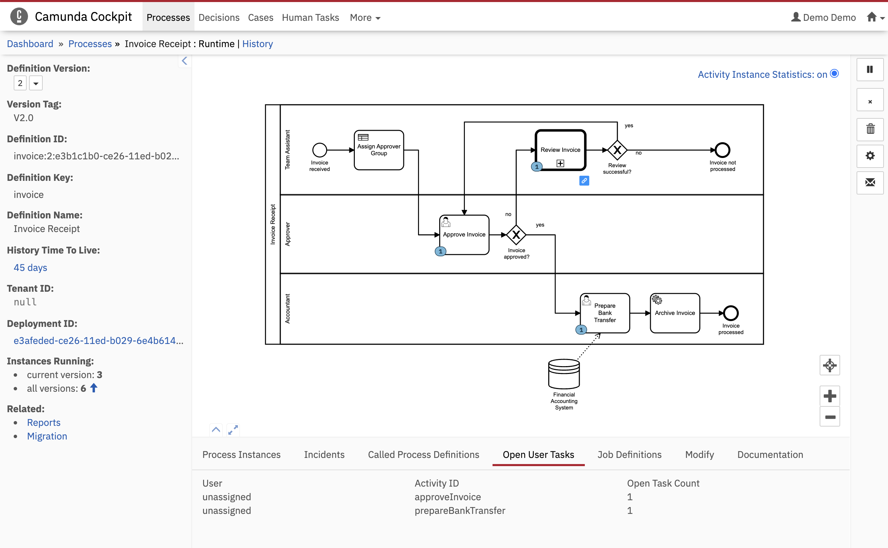

"Diagram interactions" Cockpit Plugin
=====================================

This example shows how you can achieve diagram interactions with custom plugins.
Click on an activity in the BPMN diagram to apply a filter to the table.

Built and tested against Camunda Platform version `7.14.0`.




Diagram Interaction
-------------------

To achieve diagram interaction, we will use 2 plugins scoped in one module.
The first plugin registers at `cockpit.processDefinition.diagram.plugin` or another diagram plugin point and registers a listener on the viewer event bus. With the dispatched event we can call our own functions:
```javascript
render: viewer => {
  viewer.get("eventBus").on("element.click", event => {
    if (event.element.type.includes("Task")) {
      cb(event.element);
    }
    // ...
  });
}
```

In the second plugin, we can create a callback function which the diagram plugin calls. In this example, we will apply a filter to a table depending on what task was clicked on.

```javascript
  render: (node, { processDefinitionId }) => {
    // ...
    cb = el => {
      getUsertasks(el.id);
    };
  }
```

Integrate into Camunda Webapp
-----------------------------

Copy the `plugin.js` file into the `app/cockpit/scripts/` folder in your Camunda webapp distribution.
For the Tomcat distribution, this would be `server/apache-tomcat-X.X.XX/webapps/camunda/app/cockpit/scripts/`.

Add the following content to the `app/cockpit/scripts/config.js` file:

```
// …
  customScripts: [
    'scripts/plugin.js'
  ]
// …
```

After that start the server, login to Cockpit and navigate to the process definition view to check the result.

License
-------

Use under terms of the [Apache License, Version 2.0](http://www.apache.org/licenses/LICENSE-2.0)
