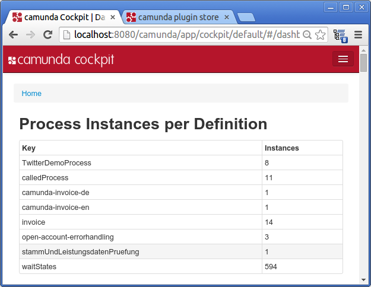
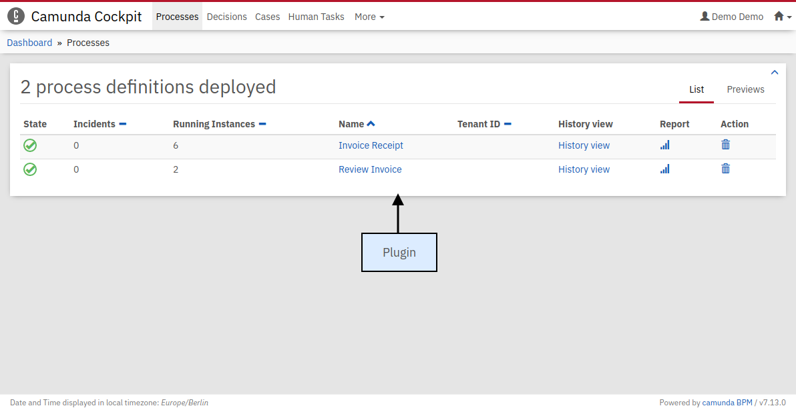

Sample Plugin for Camunda Cockpit
=================================

This is a simple plugin that showcases the plugin system of Cockpit, the process monitoring tool of [Camunda BPM](http://docs.camunda.org).

Built and tested against Camunda BPM version `7.9.0`.



# Integrate into Camunda webapp

1. Build this demo: `mvn clean install`
2. Clone the [camunda-bpm-webapp][1] repository
3. Add the plugin as a dependency to the camunda-bpm-webapp `pom.xml` and rebuild the Camunda web application.
```xml
<dependencies>
  <!-- ... -->
  <dependency>
    <groupId>org.camunda.bpm.cockpit.plugin</groupId>
    <artifactId>cockpit-sample-plugin</artifactId>
    <version>1.0-SNAPSHOT</version>
    <scope>runtime</scope>
  </dependency>
```




> Note: If you need please take a look at the [Cockpit Plug-ins](https://docs.camunda.org/manual/latest/webapps/cockpit/extend/plugins/) for the basics first.

1. [Server Side](#server-side)
	  1. [Plug-in Archive](#plug-in-archive)
	  2. [Plug-in Main Class](#plug-in-main-class)
			* [Testing Plug-in Discovery](#testing-plug-in-discovery)
	  3. [Custom Query](#custom-query)
			* [Testing Queries](#testing-queries)
	  4. [Defining and Publishing Plug-in Services](#defining-and-publishing-plug-in-services)
			* [Use Tenant Check](#use-tenant-check)
			* [Testing JAX-RS Resources](#testing-jax-rs-resources)
2. [Client Side](#client-side)
	  1. [Static Plugin Assets](#static-plugin-assets)
			* [Testing Assets](#testing-assets)
	  2. [Integration into Cockpit](#integration-into-cockpit)
	  3. [plugin.js Main File](#pluginjs-main-file)
	  4. [HTML View](#html-view)
3. [Summary](#summary)
4. [How Client-Side Plugins Work](#how-client-side-plugins-work)

## Server Side

We will walk through the important aspects of developing the server-side parts of the plug-in, i.e., creating a plug-in jar, defining a custom query and exposing that query via a JAX-RS resource.

### Plug-in Archive

As a first step we create a maven jar project that represents our plug-in library. Inside the projects `pom.xml` we must declare a dependency to the Camunda webapp with the maven coordinates `org.camunda.bpm.webapp:camunda-webapp`. The project contains all the infrastructure necessary to create and test the server-side parts of a plug-in.

```xml
<project xmlns="http://maven.apache.org/POM/4.0.0" xmlns:xsi="http://www.w3.org/2001/XMLSchema-instance"
  xsi:schemaLocation="http://maven.apache.org/POM/4.0.0 http://maven.apache.org/xsd/maven-4.0.0.xsd">
  <modelVersion>4.0.0</modelVersion>

  <groupId>org.camunda.bpm.cockpit.plugin</groupId>
  <artifactId>cockpit-sample-plugin</artifactId>
  <version>1.0-SNAPSHOT</version>
  <packaging>jar</packaging>

  <name>cockpit-sample-plugin</name>

  <dependency>
    <groupId>org.camunda.bpm.webapp</groupId>
    <artifactId>camunda-webapp</artifactId>
    <classifier>classes</classifier>
    <version>${camunda.version}</version>
  </dependency>

    <dependency>
      <groupId>junit</groupId>
      <artifactId>junit</artifactId>
      <version>4.11</version>
      <scope>test</scope>
    </dependency>
  </dependencies>
</project>
```

### Plug-in Main Class

The main entry point for a plug-in is the service provider interface (SPI) `org.camunda.bpm.cockpit.plugin.spi.CockpitPlugin`. Each plug-in must provide an implementation of this class and register it via `META-INF/services`.

We will go ahead and create an implementation of that API called `SampleCockpitPlugin`.

```java
package org.camunda.bpm.cockpit.plugin.sample;

import org.camunda.bpm.cockpit.plugin.spi.impl.AbstractCockpitPlugin;

public class SamplePlugin extends AbstractCockpitPlugin {

  public static final String ID = "sample-plugin";

  public String getId() {
    return ID;
  }
}
```

By inheriting from `org.camunda.bpm.cockpit.plugin.spi.impl.AbstractCockpitPlugin`, we ensure that the plug-in is initialized with reasonable defaults.

To register the plug-in with Cockpit, we must put its class name into a file called `org.camunda.bpm.cockpit.plugin.spi.CockpitPlugin` that resides in the directory `META-INF/services`. That will publish the plug-in via the Java [ServiceLoader facilities](http://docs.oracle.com/javase/6/docs/api/java/util/ServiceLoader.html).


#### Testing Plug-in Discovery

Now let's go ahead and write a test case that makes sure the plug-in gets discovered properly. Before we do so, we need to add test dependencies to our project `pom.xml`.

```xml
<dependencies>
  ...

  <!-- test dependencies -->
  <dependency>
    <groupId>org.camunda.bpm</groupId>
    <artifactId>camunda-engine</artifactId>
    <version>${camunda.version}</version>
    <scope>test</scope>
  </dependency>
  <dependency>
    <groupId>com.h2database</groupId>
    <artifactId>h2</artifactId>
    <version>1.3.171</version>
    <scope>test</scope>
  </dependency>
  <dependency>
    <groupId>junit</groupId>
    <artifactId>junit</artifactId>
    <version>4.11</version>
    <scope>test</scope>
  </dependency>
  ...
```

The next step consists of wiring the Camunda webapp and the process engine. To do this, we need to create a Service Provider that implements the interface `ProcessEngineProvider` and declare it in a file called `org.camunda.bpm.engine.rest.spi.ProcessEngineProvider` that resides in the directory `src/test/resources/META-INF/services/`. The file should contain the following content:

```java
org.camunda.bpm.cockpit.plugin.test.application.TestProcessEngineProvider
```

The `TestProcessEngineProvider` is provided with the Camunda webapp core, uses the methods of the class `org.camunda.bpm.BpmPlatform` and exposes the default process engine.

The class `org.camunda.bpm.cockpit.plugin.test.AbstractCockpitPluginTest` can work as a basis for Cockpit plugin tests. It initializes the Cockpit environment around each test and bootstraps a single process engine that is made available to Cockpit and the plug-in.

A first test may look as follows:

```java
package org.camunda.bpm.cockpit.plugin.sample;

import org.camunda.bpm.cockpit.Cockpit;
import org.camunda.bpm.cockpit.plugin.spi.CockpitPlugin;
import org.camunda.bpm.cockpit.plugin.test.AbstractCockpitPluginTest;
import org.junit.Assert;
import org.junit.Test;

public class SamplePluginsTest extends AbstractCockpitPluginTest {

  @Test
  public void testPluginDiscovery() {
    CockpitPlugin samplePlugin = Cockpit.getRuntimeDelegate().getPluginRegistry().getPlugin("sample-plugin");

    Assert.assertNotNull(samplePlugin);
  }
}
```

In the test `#testPluginDiscovery` we use the internal Cockpit API to check if the plug-in was recognized.

Before we can actually run the test, we need to create a `camunda.cfg.xml` to be present on the class path (usually under `src/test/resources`). That file configures the process engine to be bootstrapped.

Let's ahead and create the file with the following content:

```xml
<?xml version="1.0" encoding="UTF-8"?>

<beans xmlns="http://www.springframework.org/schema/beans"
       xmlns:xsi="http://www.w3.org/2001/XMLSchema-instance"
       xsi:schemaLocation="http://www.springframework.org/schema/beans   http://www.springframework.org/schema/beans/spring-beans.xsd">

  <bean id="processEngineConfiguration" class="org.camunda.bpm.engine.impl.cfg.StandaloneInMemProcessEngineConfiguration">

    <property name="jdbcUrl" value="jdbc:h2:mem:camunda;DB_CLOSE_DELAY=1000" />
    <property name="jdbcDriver" value="org.h2.Driver" />
    <property name="jdbcUsername" value="sa" />
    <property name="jdbcPassword" value="" />

    <!-- Database configurations -->
    <property name="databaseSchemaUpdate" value="true" />

    <!-- job executor configurations -->
    <property name="jobExecutorActivate" value="false" />

    <property name="history" value="full" />

  </bean>
</beans>
```

### Custom Query

The plug-in mechanism allows us to provide additional SQL queries that may be run against the process engine database. Those queries must be defined via MyBatis mapping files.

To implement a custom query, we will create a file `sample.xml` in the directory `org/camunda/bpm/cockpit/plugin/sample/queries` with the following content:

```xml
<?xml version="1.0" encoding="UTF-8" ?>

<!DOCTYPE mapper PUBLIC "-//mybatis.org//DTD Mapper 3.0//EN" "http://mybatis.org/dtd/mybatis-3-mapper.dtd">

<mapper namespace="cockpit.sample">

  <resultMap id="processInstanceCountMap" type="org.camunda.bpm.cockpit.plugin.sample.db.ProcessInstanceCountDto">
    <result property="key" column="KEY_" jdbcType="VARCHAR" />
    <result property="instanceCount" column="INSTANCES_" jdbcType="INTEGER" />
  </resultMap>

  <select id="selectProcessInstanceCountsByProcessDefinition" resultMap="processInstanceCountMap">
    select d.KEY_, count(d.KEY_) INSTANCES_
      from ACT_RU_EXECUTION e JOIN ACT_RE_PROCDEF d ON e.PROC_DEF_ID_ = d.ID_
      group by d.KEY_
  </select>

</mapper>
```

  both the usage of a custom namespace (`cockpit.sample`) as well as the result mapping to the plug-in provided class `org.camunda.bpm.cockpit.plugin.sample.db.ProcessInstanceCountDto`.

We need to define the class to which the result is mapped:

```java
package org.camunda.bpm.cockpit.plugin.sample.db;

public class ProcessInstanceCountDto {

  private String key;

  private int instanceCount;

  public String getKey() {
    return key;
  }

  public void setKey(String key) {
    this.key = key;
  }

  public int getInstanceCount() {
    return instanceCount;
  }

  public void setInstanceCount(int instanceCount) {
    this.instanceCount = instanceCount;
  }
}
```

Additionally, we need to publish the mapping file by overriding the method `#getMappingFiles()` in our plug-in class:

```java
public class SamplePlugin extends AbstractCockpitPlugin {

  // ...

  @Override
  public List<String> getMappingFiles() {
    return Arrays.asList("org/camunda/bpm/cockpit/plugin/sample/queries/sample.xml");
  }
}
```

#### Testing Queries

To test that the plug-in defined query actually works, we extend our testcase. By using the Cockpit provided service `QueryService` we can verify that the query can be executed:

```java
public class SamplePluginsTest extends AbstractCockpitPluginTest {

  // ...

  @Test
  public void testSampleQueryWorks() {

    QueryService queryService = getQueryService();

    List<ProcessInstanceCountDto> instanceCounts =
      queryService
        .executeQuery(
          "cockpit.sample.selectProcessInstanceCountsByProcessDefinition",
          new QueryParameters<ProcessInstanceCountDto>());

    Assert.assertEquals(0, instanceCounts.size());
  }
}
```

Note that `#getQueryService()` is merely a shortcut to the service that may also be accessed via Cockpit's main entry point, the `org.camunda.bpm.cockpit.Cockpit` class.

### Defining and Publishing Plug-in Services

Plug-ins publish their services via APIs defined through JAX-RS resources.

First, we need to add the JAX-RS API to our projects `pom.xml`. That is best done by including the following dependency:

```xml
<dependencies>
  ...

  <!-- provides jax-rs (among other APIs) -->
  <dependency>
    <groupId>org.jboss.spec</groupId>
    <artifactId>jboss-javaee-6.0</artifactId>
    <type>pom</type>
    <scope>provided</scope>
    <version>3.0.2.Final</version>
  </dependency>
  ...
```

A server-side plug-in API consists of a root resource and a number of sub resources that are provided by the root resource. A root resource may inherit from `org.camunda.bpm.cockpit.plugin.resource.AbstractPluginRootResource` to receive some basic traits. It must publish itself on the path `plugin/$pluginName` via a `@Path` annotation.

A root resource for our plug-in may look as follows:

```java
package org.camunda.bpm.cockpit.plugin.sample.resources;

import javax.ws.rs.Path;
import javax.ws.rs.PathParam;
import org.camunda.bpm.cockpit.plugin.resource.AbstractPluginRootResource;
import org.camunda.bpm.cockpit.plugin.sample.SamplePlugin;

@Path("plugin/" + SamplePlugin.ID)
public class SamplePluginRootResource extends AbstractPluginRootResource {

  public SamplePluginRootResource() {
    super(SamplePlugin.ID);
  }

  @Path("{engineName}/process-instance")
  public ProcessInstanceResource getProcessInstanceResource(@PathParam("engineName") String engineName) {
    return subResource(new ProcessInstanceResource(engineName), engineName);
  }
}
```

Note that a sub resource gets initialized by the plug-in when requests to `{engineName}/process-instance` are being made. That ensures that a Cockpit service is multi-tenancy ready out of the box (i.e. capable to work with all process engines provided by the Camunda BPM platform).

A sub-resource may extend `org.camunda.bpm.cockpit.plugin.resource.AbstractPluginResource` to get initialized with the correct process engine mappings. The resource shown below exposes our custom SQL query to the client when accessing the resource via `GET`.

```java
package org.camunda.bpm.cockpit.plugin.sample.resources;

import java.util.List;
import javax.ws.rs.GET;

import org.camunda.bpm.cockpit.db.QueryParameters;
import org.camunda.bpm.cockpit.plugin.resource.AbstractPluginResource;
import org.camunda.bpm.cockpit.plugin.sample.db.ProcessInstanceCountDto;

public class ProcessInstanceResource extends AbstractPluginResource {

  public ProcessInstanceResource(String engineName) {
    super(engineName);
  }

  @GET
  public List<ProcessInstanceCountDto> getProcessInstanceCounts() {

    return getQueryService()
        .executeQuery(
          "cockpit.sample.selectProcessInstanceCountsByProcessDefinition",
          new QueryParameters<ProcessInstanceCountDto>());
  }
}
```

To include plug-in resources into the Cockpit application those resources must be published in the main plug-in file by overriding `#getResourceClasses()`:

```java
import org.camunda.bpm.cockpit.plugin.sample.SamplePlugin;

public class SamplePlugin extends AbstractCockpitPlugin {

  // ...

  @Override
  public Set<Class<?>> getResourceClasses() {
    Set<Class<?>> classes = new HashSet<Class<?>>();

    classes.add(SamplePluginRootResource.class);

    return classes;
  }

  // ...
}
```

Given the above setup the resource class extends the Cockpit API with the following paths

```
GET $cockpit_api_root/plugin/sample/$engine/process-instance
```

#### Use Tenant Check

It is possible to use the tenant check in the sub-resource of the cockpit plugin. Therefore, the sub-resource may extend `org.camunda.bpm.cockpit.plugin.resource.AbstractPluginResource` to configure the custom query with the tenant check. See the following example for the tenant check usage.

```java
package org.camunda.bpm.cockpit.plugin.sample.resources;

import java.util.List;
import javax.ws.rs.POST;

import org.camunda.bpm.cockpit.db.QueryParameters;
import org.camunda.bpm.cockpit.plugin.resource.AbstractPluginResource;
import org.camunda.bpm.cockpit.plugin.sample.db.ProcessInstanceCountDto;

public class ProcessInstanceResource extends AbstractPluginResource {

  public ProcessInstanceResource(String engineName) {
    super(engineName);
  }

  @GET
  public List<ProcessInstanceCountDto> getProcessInstanceCounts() {
    QueryParameters<ProcessInstanceCountDto> queryParameters = new QueryParameters<ProcessInstanceCountDto>();

    configureTenantCheck(queryParameters);

    return getQueryService()
        .executeQuery(
          "cockpit.sample.selectProcessInstanceCountsByProcessDefinition", queryParameters);
  }
}
```

Additionally, it is necessary to include the tenant check query to the custom query XML file. For it, add the following line to the custom query.

```xml
<include refid="org.camunda.bpm.engine.impl.persistence.entity.TenantEntity.queryTenantCheck" />
```

#### Testing JAX-RS Resources

To test your JAX-RS resources you can instantiate them directly during a plug-in test case. Alternatively, you can write a real API test using [arquillian](http://arquillian.org/).

Now we are done with the server-side parts of the plug-in. Next, we will go ahead and write the client-side extension that exposes the functionality to the user.

## Client Side


>This section only provides a short overview of the client-side plug-in mechanism in Cockpit.
>Consider reading [How client-side plug-ins work](#how-client-side-plugins-work) if you are interested in more details.


The client-side part of a Cockpit plug-in consists of an extension to the Cockpit webapp client application. It is served through the plug-in serverside extension as a static plug-in asset.

### Static Plugin Assets

When using `AbstractPluginRootResource` as the plug-in resources base class, serving static assets is already built in. The root resource accepts a `GET` request under `/static` to serve plug-in-provided client-side resources. Per convention, these resources must reside in a `/plugin-webapp/$plugin_id` directory absolute to the classpath root.

So, let's create a file `plugin-webapp/$plugin_id/info.txt` in the `src/main/resources` directory of our project. We can give it the following content (optional):

```
FOO BAR
```

#### Testing Assets

To test that the assets are served, we can either implement a test case or test the matter manually after we integrated the plug-in into the Cockpit webapp.

### Integration into Cockpit

There are two ways to add your plugin to the Camunda BPM webapp.

1. You can copy it to the `WEB-INF/lib` folder of the Camunda webapp.
2. You can set up a maven war overlay for the Camunda webapp.

The first solution is the simplest: if you dowloaded the tomcat distribution, you can copy the plugin
jar file to the `/server/apache-tomcat-${tomcat-version}/webapps/camunda/WEB-INF/lib/` folder and
restart the server.

### plugin.js Main File

Each plug-in must contain a file `app/plugin.js` in the plug-ins assets directory (i.e., `plugin-webapp/$plugin_id`). That file bootstraps the client-side plug-in and registers it with Cockpit. To do so it must declare and return an [angular module](http://docs.angularjs.org/guide/module) named `cockpit.plugin.$plugin_id` using [requireJS](http://requirejs.org/).

Without going too deeply into detail, our plugins `plugin.js` may look like this:

```javascript
define(['angular'], function(angular) {

  var DashboardController = ["$scope", "$http", "Uri", function($scope, $http, Uri) {

    $http.get(Uri.appUri("plugin://sample-plugin/:engine/process-instance"))
      .success(function(data) {
        $scope.processInstanceCounts = data;
      });
  }];

  var Configuration = ['ViewsProvider', function(ViewsProvider) {

    ViewsProvider.registerDefaultView('cockpit.dashboard', {
      id: 'process-definitions',
      label: 'Deployed Processes',
      url: 'plugin://sample-plugin/static/app/dashboard.html',
      controller: DashboardController,

      // make sure we have a higher priority than the default plugin
      priority: 12
    });
  }];

  var ngModule = angular.module('cockpit.plugin.sample-plugin', []);

  ngModule.config(Configuration);

  return ngModule;
});
```

The file defines the angular module `cockpit.plugin.sample-plugin` and registers a plug-in with the Cockpit plug-in service (`ViewsProvider#registerDefaultView()`).

### HTML View

To complete the example, we need to define the HTML file `app/dashboard.html` as a plug-in asset:

```html
<div>
  <h1>Process Instances per Definition</h1>
  <table class="table table-bordered table-hover table-condensed">
    <thead>
      <tr>
        <th>Key</th>
        <th>Instances</th>
      </tr>
    </thead>
    <tbody>
      <tr data-ng-repeat="count in processInstanceCounts">
        <td>{{ count.key }}</td>
        <td>{{ count.instanceCount }}</td>
      </tr>
    </tbody>
  </table>
</div>
```

This file provides the actual view to the user.

When deploying the extended Camunda webapplication on the Camunda BPM platform, we can see the plug-in in action.

## Summary

You made it! In this example we walked through all important steps required to build a Cockpit plug-in, from creating a plug-in skeleton through defining server-side plug-in parts up to implementing the client-side portions of the plug-in.


## Appendix

### How Client-Side Plugins Work

Some experience in <a href="https://developer.mozilla.org/en-US/docs/Web/JavaScript">JavaScript</a> development as well as knowledge about <a href="http://angularjs.org/">AngularJS</a> and <a href="http://requirejs.org">RequireJS</a> is beneficial to understanding this subsection.

The client-side plug-in infrastructure provides extensions to the Cockpit core application through views that expose data provided by a plugins server-side API. We'll quickly elaborate on how the interaction between a plug-in and the Camunda webapplication happens.

A plug-in is defined in an `app/plugin.js` file that gets served as static plug-in asset:

```javascript
define([
  'jquery',
  'angular',
  'http://some-url/some-library.js',
  './someOtherModule.js'
], function($, angular) {

  var ViewController = ['$scope', function($scope, Uri) {
    // perform logic

    // uris to plugin assets and apis may be resolved via Uri#appUri
    // by prefixing those apis with 'plugin://'
    var pluginServiceUrl = Uri.appUri('plugin://myPlugin/default/process-definition');

  }];

  var ngModule = angular.module('cockpit.plugin.myPlugin', ['some.other.angularModule']);

  // publish the plugin to cockpit
  ngModule.config(function(ViewsProvider) {

    ViewsProvider.registerDefaultView('cockpit.some-view', {
      id: 'some-view-special-plugin',
      label: 'Very Special Plugin',
      url: 'plugin://myPlugin/static/app/view.html',
      controller: ViewController
    });
  });

  return ngModule;
});
```

As the file is loaded as a RequireJS module, dependencies (in terms of other RequireJS modules) may be specified.

The plug-in must register itself with the `ViewsProvider` via a [module configuration hook](http://docs.angularjs.org/api/angular.Module).

From within Cockpit, views are included using the [view directive](https://github.com/camunda/camunda-commons-ui/blob/master/lib/plugin/view.js):

```html
<view provider="viewProvider" vars="viewProviderVars" />
```

The actual provider that defines the view as well as the published variables are defined by the responsible controller in the surrounding scope:

```javascript
function SomeCockpitController($scope, Views) {
  $scope.viewProvider = Views.getProvider({ component: 'cockpit.some-view'});

  // variable 'foo' will be available in the view provider scope
  $scope.viewProviderVars = { read: [ 'foo' ]};
}
```
# License

Use under terms of the [Apache License, Version 2.0](http://www.apache.org/licenses/LICENSE-2.0)

[1]: https://github.com/camunda/camunda-bpm-webapp
[2]: https://docs.camunda.org/manual/examples/tutorials/develop-cockpit-plugin/
