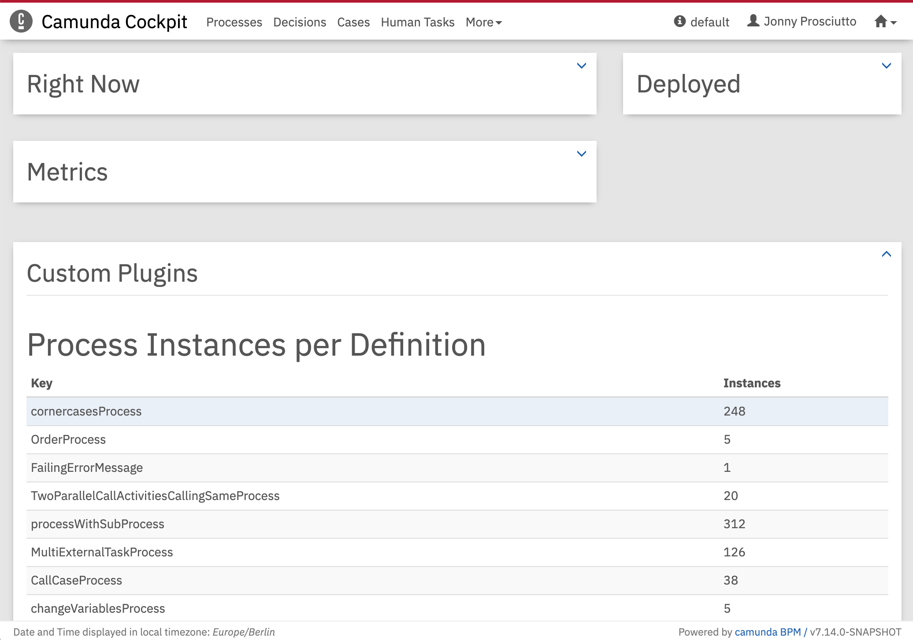

Sample Plugin for Camunda Cockpit
=================================

This is a simple plugin that showcases the plugin system of Cockpit, the process monitoring tool of [Camunda BPM](http://docs.camunda.org).

Built and tested against Camunda BPM version `7.4.0`.

Integrate into Camunda webapp
-----------------------------

Add the plugin as a dependency to the Cockpit `pom.xml` and rebuild the Camunda web application.

    <dependencies>
      ...
      <dependency>
        <groupId>org.camunda.bpm.cockpit.plugin</groupId>
        <artifactId>cockpit-sample-plugin</artifactId>
        <version>1.0-SNAPSHOT</version>
        <scope>runtime</scope>
      </dependency>

Guide
-----

Read [How to develop a Cockpit plugin][1].

License
-------

Use under terms of the [Apache License, Version 2.0](http://www.apache.org/licenses/LICENSE-2.0)

[1]: https://docs.camunda.org/manual/examples/tutorials/develop-cockpit-plugin/
