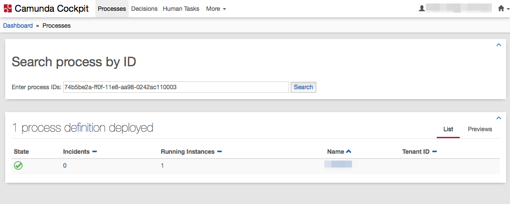

# Search process by ID, a simple plugin for Camunda Cockpit

Simple js plugin for Camunda BPMS standard web application Cockpit.
Adds ability to search process by its ID.

## Installation

- Copy the `searchBPbyID.js` file into the app/cockpit/scripts/ folder in your Camunda webapp distribution. For the Tomcat distribution, this would be server/apache-tomcat-X.X.XX/webapps/camunda/app/cockpit/scripts/.
- Add plugin by editing `config.js` as in given example or just use provided `config.js` file instead default one.

You should see this plugin in Camunda Cockpit's "Processes" dashboard.



## Docker notes
Both js files should be placed to `/camunda/webapps/camunda/app/cockpit/scripts` directory of your Camunda docker container.
Tested on standard [Camunda docker image](https://github.com/camunda/docker-camunda-bpm-platform).

Edit `Dockerfile` for embedding plugin to your image by adding this:
```
COPY /path-to-scripts/config.js /camunda/webapps/camunda/app/cockpit/scripts/config.js
COPY /path-to-scripts/searchBPbyID.js /camunda/webapps/camunda/app/cockpit/scripts/searchBPbyID.js
```

"Hot deploying" to running docker container working as well:
```
docker cp /path-to-scripts/searchBPbyID.js camunda-container-name:/camunda/webapps/camunda/app/cockpit/scripts/searchBPbyID.js
docker cp /path-to-scripts/config.js camunda-container-name:/camunda/webapps/camunda/app/cockpit/scripts/config.js
```

# TODO

- testing?

# License
Based on demo code [cats.js](https://github.com/camunda/camunda-bpm-examples/tree/master/cockpit/js-only-plugin) from Camunda examples.

Use under terms of the [Apache License, Version 2.0](http://www.apache.org/licenses/LICENSE-2.0)
