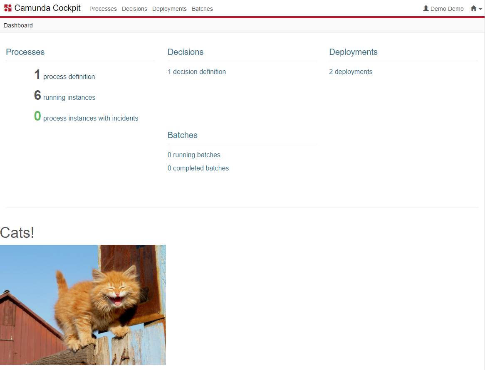

Javascript Only Plugin for Camunda Cockpit
=================================

This example shows how to develop a Cockpit plugin without the need to register it with the Camunda BPM server. It makes use of the `customScript` property of the webapp configurations.

Built and tested against Camunda BPM version `7.9.0`.




Integrate into Camunda Webapp
-----------------------------

Copy the `cats.js` file into the `app/cockpit/scripts/` folder in your Camunda webapp distribution. For the Tomcat distribution, this would be `server/apache-tomcat-X.X.XX/webapps/camunda/app/cockpit/scripts/`.

Add the following content to the `customScripts` object in the `app/cockpit/scripts/config.js` file:

```
  // …
  customScripts: {
    ngDeps: ['cockpit.cats'],

    deps: ['cats'],

    // RequreJS path definitions
    paths: {
      'cats': 'scripts/cats'
    }
  }
  // …
```

License
-------

Use under terms of the [Apache License, Version 2.0](http://www.apache.org/licenses/LICENSE-2.0)
