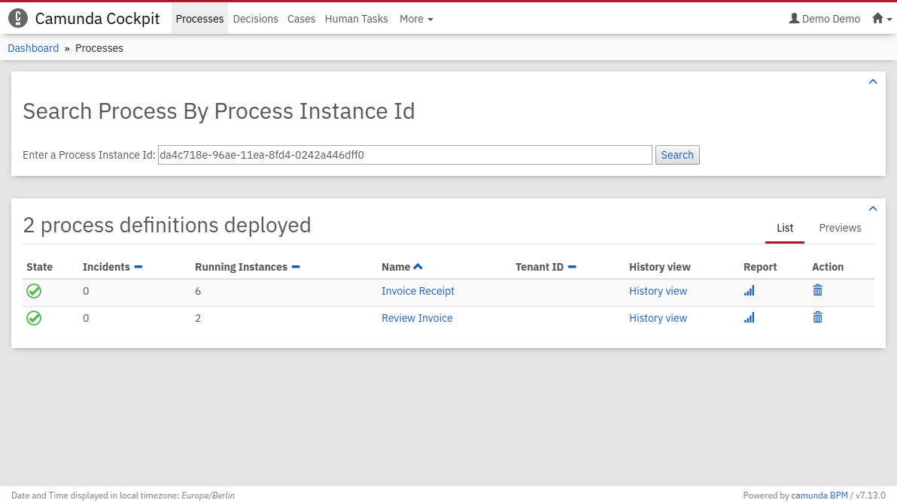

# Javascript Only Plugin for Camunda Cockpit: Search Process By Process Instance Id

A simple plugin to search for a process by its process instance id.

## Installation

- Copy the `searchProcess.js` file into the `app/cockpit/scripts/` folder of the Camunda Webapp.
For the Tomcat distribution, this folder is located under `server/apache-tomcat-X.X.XX/webapps/camunda/app/cockpit/scripts/`.
- Add the plugin by editing `config.js` as follows:
```javascript
window.camCockpitConf = {
  // ...

  customScripts: {
    ngDeps: ['cockpit.searchProcess'],

    deps: ['searchProcess'],

    paths: {
      'searchProcess': 'scripts/searchProcess'
    }
  }
  // ...
};
```

You should see this plugin in Camunda Cockpit's "Processes" dashboard.



# License
Use under terms of the [Apache License, Version 2.0](http://www.apache.org/licenses/LICENSE-2.0)
