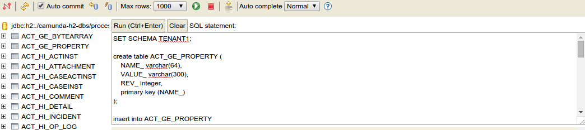
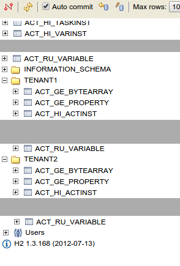

# Multi-Tenancy with Tenant Isolation via Database Schemas

<li><a href="#before-starting">Before Starting</a></li>
<li><a href="#configuring-the-database">Configuring the Database</a></li>
<li><a href="#configuring-process-engines">Configuring Process Engines</a></li>
<li><a href="#develop-a-tenant-aware-process-application">Develop a Tenant-Aware Process Application</a>
<ul>
<li><a href="#set-up-the-process-application">Set Up the Process Application</a></li>
<li><a href="#configure-a-tenant-specific-deployment">Configure a Tenant-specific Deployment</a></li>
<li><a href="#build-a-simple-jax-rs-resource">Build a Simple JAX-RS Resource</a></li>
<li><a href="#make-cdi-injection-tenant-aware">Make CDI Injection Tenant-aware</a></li>
</ul></li>
<li><a href="#deploy-the-application-to-jboss">Deploy the Application to JBoss</a></li>
<li><a href="#testing">Testing</a></li>


Sometimes it is desired to share one Camunda installation between multiple independent parties, also referred to as *tenants*. While sharing an installation means sharing computational resources, the tenants' data should be separated from each other. This tutorial shows how to work with the [one process engine per tenant approach](https://docs.camunda.org/manual/latest/user-guide/process-engine/multi-tenancy/#one-process-engine-per-tenant).

In detail it explains how to:

* configure one process engine per tenant on a JBoss Application Server such that data is isolated by database schemas
* develop a process application with tenant-specific deployments
* access the correct process engine from a REST resource based on a tenant identifier

See the [user guide](https://docs.camunda.org/manual/latest/user-guide/process-engine/multi-tenancy/) for a general introduction on multi-tenancy and the different options Camunda offers.


# Before Starting

Before starting, make sure to download the [Camunda BPM JBoss distribution](http://camunda.org/download/) and extract it to a folder. We will call this folder `$CAMUNDA_HOME` in the following explanations.


# Configuring the Database

Before configuring process engines, we have to set up a database schema for every tenant. In this section we will explain how to do so.

Start up JBoss by running `$CAMUNDA_HOME/start-camunda.{bat/sh}`. After startup, open your browser and go to `http://localhost:8080/h2/h2`. Enter the following configuration before connecting:

* **Driver Class**: org.h2.Driver
* **JDBC URL**: jdbc:h2:./camunda-h2-dbs/process-engine
* **User Name**: sa
* **Password**: sa

Create two different schemas for the different process engines:

```sql
create schema TENANT1;
create schema TENANT2;
```

Next, inside each schema, create the database tables. To achieve this, get the SQL create scripts
from the jboss distribution from the `sql/create/` folder inside your distribution.

Inside the h2 console, execute the create scripts (`h2_engine_7.2.0.sql` and
`h2_identity_7.2.0.sql`) scripts after selecting the appropriate schema for the current connection:

```sql
set schema TENANT1;

<<paste sql/create/h2_engine_7.2.0.sql here>>
<<paste sql/create/h2_identity.2.0.sql here>>

set schema TENANT2;

<<paste sql/create/h2_engine_7.2.0.sql here>>
<<paste sql/create/h2_identity.2.0.sql here>>
```

The following screenshot illustrates how to create the tables inside the correct schema:




Next, hit *run*.

After creating the tables in the two schemas, the UI should show the following
table structure:




Now, stop JBoss.


# Configuring Process Engines

In this step, we configure a process engine for each tenant. We ensure that these engines access the database schemas we have previously created. This way, process data of a tenant cannot interfere with that of another.

Open the file `$CAMUNDA_HOME/server/jboss-as-{version}/standalone/configuration/standalone.xml`. In that file, navigate to the configuration of the Camunda jboss subsystem, declared in an XML element `<subsystem xmlns="urn:org.camunda.bpm.jboss:1.1">`. In this file, add two entries to the `<process-engines>` section (do *not* remove default engine configuration):

The configuration of the process engine for tenant 1:

```xml
<process-engine name="tenant1">
  <datasource>java:jboss/datasources/ProcessEngine</datasource>
  <history-level>none</history-level>
  <properties>
      <property name="databaseTablePrefix">TENANT1.</property>
      <property name="jobExecutorAcquisitionName">default</property>

      <property name="isAutoSchemaUpdate">false</property>
      <property name="authorizationEnabled">true</property>
      <property name="jobExecutorDeploymentAware">true</property>
  </properties>
  <plugins>
    <!-- plugin enabling Process Application event listener support -->
    <plugin>
      <class>org.camunda.bpm.application.impl.event.ProcessApplicationEventListenerPlugin</class>
    </plugin>
  </plugins>
</process-engine>
```

The configuration of the process engine for tenant 2:

```xml
<process-engine name="tenant2">
  <datasource>java:jboss/datasources/ProcessEngine</datasource>
  <history-level>none</history-level>
  <properties>
      <property name="databaseTablePrefix">TENANT2.</property>
      <property name="jobExecutorAcquisitionName">default</property>

      <property name="isAutoSchemaUpdate">false</property>
      <property name="authorizationEnabled">true</property>
      <property name="jobExecutorDeploymentAware">true</property>
  </properties>
  <plugins>
    <!-- plugin enabling Process Application event listener support -->
    <plugin>
      <class>org.camunda.bpm.application.impl.event.ProcessApplicationEventListenerPlugin</class>
    </plugin>
  </plugins>
</process-engine>
```

(find the complete `standalone.xml` [here](https://github.com/camunda/camunda-bpm-examples/blob/master/multi-tenancy/schema-isolation/standalone.xml))

By having a look at the `datasource` configuration, you will notice that the data source is shared between all engines. The property `databaseTablePrefix` points the engines to different database schemas. This makes it possible to shares resources like a database connection pool between both engines. Also have a look at the entry `jobExecutorAcquisitionName`. The job acquisition is part of the job executor, a component responsible for executing asynchronous tasks in the process engine (cf. the `job-executor` element in the subsystem configuration). Again, the `jobExecutorAcquisitionName` configuration enables reuse of one acquisition thread for all engines.

The approach of configuring multiple engines also allows you to differ engine configurations apart from the database-related parameters. For example, you can activate process engine plugins for some tenants while excluding them for others.


# Develop a Tenant-Aware Process Application

In this step, we describe a process application that deploys different processes for the two tenants. It also exposes a REST resource that returns a tenant's process definitions. To identify the tenant, we provide a user name in the REST request. In the implementation, we use CDI to transparently interact with the correct process engine based on the tenant identifier.


The following descriptions highlight the concepts related to implementing multi-tenancy but are not a step-by-step explanation to develop along. Instead, make sure to checkout the <a href="https://github.com/camunda/camunda-bpm-examples/tree/master/multi-tenancy/schema-isolation">code on github</a>. The code can be built and deployed to JBoss right away and contains all the snippets explained in the following sections.



## Set Up the Process Application

In the project, we have set up a plain Camunda EJB process application.

In [pom.xml](https://github.com/camunda/camunda-bpm-examples/blob/master/multi-tenancy/schema-isolation/pom.xml), the `camunda-engine-cdi` and `camunda-ejb-client` dependencies are added:

```xml
<dependency>
  <groupId>org.camunda.bpm</groupId>
  <artifactId>camunda-engine-cdi</artifactId>
</dependency>

<dependency>
  <groupId>org.camunda.bpm.javaee</groupId>
  <artifactId>camunda-ejb-client</artifactId>
</dependency>
```

These are required to inject process engines via CDI.


## Configure a Tenant-specific Deployment

In the folder `src/main/resources`, we have added a folder `processes` and two subfolders `tenant1` and `tenant2`. These folders contain a [process for tenant 1](https://github.com/camunda/camunda-bpm-examples/tree/master/multi-tenancy/schema-isolation/src/main/resources/processes/tenant1) and a [process for tenant 2](https://github.com/camunda/camunda-bpm-examples/tree/master/multi-tenancy/schema-isolation/src/main/resources/processes/tenant2), respectively.

In order to deploy the two definitions to the two different engines, we have added a file `src/main/resources/META-INF/processes.xml` with the following content:

```xml
<process-application
  xmlns="http://www.camunda.org/schema/1.0/ProcessApplication"
  xmlns:xsi="http://www.w3.org/2001/XMLSchema-instance">

  <process-archive name="tenant1-archive">
    <process-engine>tenant1</process-engine>
    <properties>
      <property name="resourceRootPath">classpath:processes/tenant1/</property>

      <property name="isDeleteUponUndeploy">false</property>
      <property name="isScanForProcessDefinitions">true</property>
    </properties>
  </process-archive>

  <process-archive name="tenant2-archive">
    <process-engine>tenant2</process-engine>
    <properties>
      <property name="resourceRootPath">classpath:processes/tenant2/</property>

      <property name="isDeleteUponUndeploy">false</property>
      <property name="isScanForProcessDefinitions">true</property>
    </properties>
  </process-archive>

</process-application>
```

This file declares two *process archives*. By the `process-engine` element, we can specify the engine to which an archive should be deployed. By the `resourceRootPath`, we can assign different portions of the contained process definitions to different process archives.


## Build a Simple JAX-RS Resource

To showcase the programming model for multi-tenancy with CDI, we have added a simple REST resource that returns all deployed process definitions for a process engine. The resource has the following [source code](https://github.com/camunda/camunda-bpm-examples/blob/master/multi-tenancy/schema-isolation/src/main/java/org/camunda/bpm/tutorial/multitenancy/ProcessDefinitionResource.java):

```java
@Path("/process-definition")
public class ProcessDefinitionResource {

  @Inject
  protected ProcessEngine processEngine;

  @GET
  @Produces(MediaType.APPLICATION_JSON)
  public List<ProcessDefinitionDto> getProcessDefinitions() {
    List<ProcessDefinition> processDefinitions =
        processEngine.getRepositoryService().createProcessDefinitionQuery().list();

    return ProcessDefinitionDto.fromProcessDefinitions(processDefinitions);
  }
}
```

Note that the distinction between tenants is not made in this resource.


## Make CDI Injection Tenant-aware

We want the injected process engine to always be the one that matches the current tenant making a REST request. For this matter, we have added a request-scoped [tenant bean](https://github.com/camunda/camunda-bpm-examples/blob/master/multi-tenancy/schema-isolation/src/main/java/org/camunda/bpm/tutorial/multitenancy/Tenant.java):

```java
@RequestScoped
public class Tenant {

  protected String id;

  public String getId() {
    return id;
  }

  public void setId(String id) {
    this.id = id;
  }
}
```

To populate this bean with the tenant ID for the current user, we add a [RestEasy interceptor](https://github.com/camunda/camunda-bpm-examples/blob/master/multi-tenancy/schema-isolation/src/main/java/org/camunda/bpm/tutorial/multitenancy/TenantInterceptor.java). This interceptor is called before a REST request is dispatched to the `ProcessDefinitionResource`. It has the following content:

```java
@Provider
@ServerInterceptor
public class TenantInterceptor implements PreProcessInterceptor {

  protected static final Map<String, String> USER_TENANT_MAPPING = new HashMap<String, String>();

  static {
    USER_TENANT_MAPPING.put("kermit", "tenant1");
    USER_TENANT_MAPPING.put("gonzo", "tenant2");
  }

  @Inject
  protected Tenant tenant;

  public ServerResponse preProcess(HttpRequest request, ResourceMethod method) throws Failure, WebApplicationException {
    List<String> user = request.getUri().getQueryParameters().get("user");

    if (user.size() != 1) {
      throw new WebApplicationException(Status.BAD_REQUEST);
    }

    String tenantForUser = USER_TENANT_MAPPING.get(user.get(0));
    tenant.setId(tenantForUser);

    return null;
  }
}
```

Note that the tenant ID is determined based on a simple static map. Of course, in real-world applications one would implement a more sophisticated lookup procedure here.

To resolve the process engine based on the tenant, we have [specialized the process engine producer](https://github.com/camunda/camunda-bpm-examples/blob/master/multi-tenancy/schema-isolation/src/main/java/org/camunda/bpm/tutorial/multitenancy/TenantAwareProcessEngineServicesProducer.java) bean as follows:

```java
@Specializes
public class TenantAwareProcessEngineServicesProducer extends ProcessEngineServicesProducer {

  @Inject
  private Tenant tenant;

  @Override
  @Named
  @Produces
  @RequestScoped
  public ProcessEngine processEngine() {
    CommandContext commandContext = Context.getCommandContext();

    if (commandContext == null) {
      return getProcessEngineByTenantId(tenant.getId());

    } else {
      // used within the process engine (e.g. by the job executor)
      return commandContext.getProcessEngineConfiguration().getProcessEngine();
    }
  }

  protected ProcessEngine getProcessEngineByTenantId(String tenantId) {
    if (tenantId != null) {
      ProcessEngine processEngine = BpmPlatform.getProcessEngineService().getProcessEngine(tenantId);
      if (processEngine != null) {
        return processEngine;
      } else {
        throw new ProcessEngineException("No process engine found for tenant id '" + tenantId + "'.");
      }
    } else {
      throw new ProcessEngineException("No tenant id specified. A process engine can only be retrieved based on a tenant.");
    }
  }

  @Override
  @Produces
  @Named
  @RequestScoped
  public RuntimeService runtimeService() {
    return processEngine().getRuntimeService();
  }

  ...
}
```

The producer determines the engine based on the current tenant. It encapsulates the logic of resolving the process engine for the current tenant entirely. Every bean can simply declare `@Inject ProcessEngine` without specifying which specific engine is addressed to work with the current tenant's engine.


# Deploy the Application to JBoss

Start up JBoss. Build the process application and deploy the resulting war file to JBoss.

Make a GET request (e.g., by entering the URL in your browser) against the following URL to get all process definitions deployed to tenant 1's engine: http://localhost:8080/multi-tenancy-tutorial/process-definition?user=kermit

Only the process for tenant 1 is returned.

Make a GET request against the following URL to get all process definitions deployed to tenant 2's engine:
http://localhost:8080/multi-tenancy-tutorial/process-definition?user=gonzo

Only the process for tenant 2 is returned.

Go to Camunda Cockpit and switch the engine to `tenant1` on the following URL (you will be asked to create an admin user first):
http://localhost:8080/camunda/app/cockpit/tenant1

Only the process for tenant 1 shows up. You can check the same for tenant 2 by switching to engine `tenant2`.

And you're done! :)


# Testing

The test class [ProcessIntegrationTest](src/test/java/org/camunda/bpm/tutorial/multitenancy/ProcessIntegrationTest.java) uses Arquillian to verify the behavior. 

Follow the steps to run the test:

* download the [Camunda BPM JBoss distribution](https://camunda.org/download/)
* replace the `camunda-bpm-jboss-{version}/server/jboss-as-{version}/standalone/configuration/standalone.xml` with
  * [standalone.xml](standalone.xml) (two schemas - requires manual schema creation) or 
  * [standalone_test.xml](standalone_test.xml) (two databases - auto schema creation)
* start the server using the script `camunda-bpm-jboss-{version}/start-camunda.bat`
* go to project directory and run the test with the Maven command `mvn test` 

