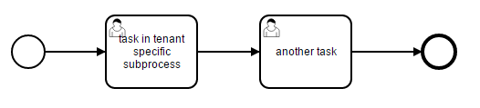

# Multi-Tenancy with Tenant Identifiers and Shared Process Definitions

This example demonstrates how to use multi-tenancy with shared process definitions. A shared process definition is a definition which is deployed without a tenant id and is used by all tenants. When a tenant creates an instance of such a process definition then the instance gets the id of the tenant. 

You learn

* How to provide tenant ids for instances of shared process definitions
* How to override default process definitions with tenant specific once

The example contains two shared process definitions (main proces and sub-process):


## How it works

Please refer to the [User Guide](http://docs.camunda.org/manual/develop/user-guide/process-engine/multi-tenancy/) for details about multi-tenancy.

### Provide Tenant Ids for Instances of Shared Process Definitions

Implement the SPI `TenantIdProvider`. In this example, the tenant-id is resolved based on the current authenticated tenant.

```java
public class CustomTenantIdProvider implements TenantIdProvider {

  @Override
  public String provideTenantIdForProcessInstance(TenantIdProviderProcessInstanceContext ctx) {
    return getTenantIdOfCurrentAuthentication();
  }

  @Override
  public String provideTenantIdForCaseInstance(TenantIdProviderCaseInstanceContext ctx) {
    return getTenantIdOfCurrentAuthentication();
  }

  @Override
  public String provideTenantIdForHistoricDecisionInstance(TenantIdProviderHistoricDecisionInstanceContext ctx) {
    return getTenantIdOfCurrentAuthentication();
  }

  protected String getTenantIdOfCurrentAuthentication() {

    IdentityService identityService = Context.getProcessEngineConfiguration().getIdentityService();
    Authentication currentAuthentication = identityService.getCurrentAuthentication();

    if (currentAuthentication != null) {

      List<String> tenantIds = currentAuthentication.getTenantIds();
      if (tenantIds.size() == 1) {
        return tenantIds.get(0);

      } else if (tenantIds.isEmpty()) {
        throw new IllegalStateException("no authenticated tenant");

      } else {
        throw new IllegalStateException("more than one authenticated tenant");
      }

    } else {
      throw new IllegalStateException("no authentication");
    }
  }

}
```

Now, set the custom `TenantIdProvider` on the `ProcessEngineConfiguration`.

```xml
<bean id="processEngineConfiguration" 
  class="org.camunda.bpm.engine.impl.cfg.StandaloneInMemProcessEngineConfiguration">
    
  <!-- set the custom tenant id provider -->
  <property name="tenantIdProvider" ref="tenantIdProvider" />
  
</bean>

<!-- provides the tenant id of process instances --> 
<bean id="tenantIdProvider" class="org.camunda.bpm.tutorial.multitenancy.CustomTenantIdProvider" />
```

That's it!

To verify the behavior you have to 
* deploy the process definitions without a tenant id
* set the authenticated tenant
* create an instance of a shared process definition

```java
// deploy shared process definitions (which belongs to no tenant)
repositoryService
  .createDeployment()
  .addClasspathResource("processes/default/mainProcess.bpmn")
  .addClasspathResource("processes/default/subProcess.bpmn")
  .deploy();

// set the authenticated tenant and start a process instance
identityService.setAuthentication("john", null, Collections.singletonList("tenant1"));

runtimeService.startProcessInstanceByKey("mainProcess");

// check that the process instance got the tenant id from the custom tenant id provider
ProcessInstance processInstance = runtimeService.createProcessInstanceQuery()
  .processDefinitionKey("mainProcess")
  .singleResult();

assertThat(processInstance.getTenantId(), is("tenant1"));
```

### Override Default Process Definitions with tenant specific once

Assuming that all tenants share mostly the same process but can differ in small parts. These parts are extracted as sub-processes which are called by the main process. 

In this example, one tenant (tenant 2) should have a different sub-process:



The sub-process has the same process definition key like the default one and is deployed for the specific tenant.

In order to use the tenant specific sub-process, the tenant id of the called element has to be set on the call activity using the `camunda:calledElementTenantId` attribute.

```xml
<bpmn:callActivity id="CallActivity_0ahffuc" name="subprocess" 
  calledElement="subProcess" 
  camunda:calledElementTenantId="${ calledElementTenantIdProvider.resolveTenantId(execution) }">
  <!-- ... --->    
</bpmn:callActivity>
```

Here, a bean is invoked to resolve the tenant id. It checks if a process definition is deployed for the tenant and returns their id. Otherwise, it returns `null` to use the default definition.

```java
public class CalledElementTenantIdProvider {

  public String resolveTenantId(DelegateExecution execution) {
    RepositoryService repositoryService = execution.getProcessEngineServices().getRepositoryService();

    String tenantId = execution.getTenantId();

    // resolve the process definition key
    CallActivity callActivity = (CallActivity) execution.getBpmnModelElementInstance();
    String processDefinitionKey = callActivity.getCalledElement();

    // and check if a process definition is deployed for the tenant
    ProcessDefinition processDefinition = repositoryService.createProcessDefinitionQuery()
      .processDefinitionKey(processDefinitionKey)
      .tenantIdIn(tenantId)
      .latestVersion()
      .singleResult();

    if (processDefinition != null) {
      // use tenant-specific process definition
      return tenantId;
    } else {
      // use default process definition
      return null;
    }
  }

}
```

To verify the behavior you have to 
* deploy the default process definitions without a tenant id
* deploy the sub-process definition for tenant ('tenant2')
* set the authenticated tenant
* create an instance of a shared process definition
* and checks if it calls the default or the tenant specific sub-process

```java
// deploy default process definitions (which belongs to no tenant)
repositoryService
  .createDeployment()
  .addClasspathResource("processes/default/mainProcess.bpmn")
  .addClasspathResource("processes/default/subProcess.bpmn")
  .deploy();

// deploy custom process definition for 'tenant2'
repositoryService
  .createDeployment()
  .tenantId("tenant2")
  .addClasspathResource("processes/tenant2/subProcess.bpmn")
  .deploy();

// set the authenticated tenant and start a process instance
identityService.setAuthentication("mary", null, Collections.singletonList("tenant2"));

runtimeService.startProcessInstanceByKey("mainProcess");

// check that the process instance has the tenant id 'tenant2'
ProcessInstance processInstance = runtimeService.createProcessInstanceQuery()
  .processDefinitionKey("mainProcess")
  .singleResult();

assertThat(processInstance.getTenantId(), is("tenant2"));

// and started the tenant-specific sub-process which overrides the default one
Task task = taskService.createTaskQuery().processDefinitionKey("subProcess").singleResult();
assertThat(task.getName(), is("task in tenant specific subprocess"));
```

## How to use it?

1. Checkout the project with Git
2. Import the project into your IDE
3. Inspect the sources and run the unit tests.
