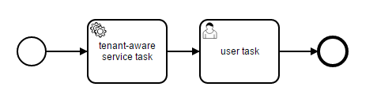

# Multi-Tenancy with Tenant Identifiers for Shared Process Engine

This example demonstrates how to use multi-tenancy for a shared process engine. You learn

* How to deploy a process definition with a tenant-id,
* How to start a process instance from a process definition with a tenant-id,
* How to implement a service task which uses the tenant-id from the process instance

The example process for the tenants looks like:



## How it works

Please refer to the [User Guide](http://docs.camunda.org/manual/develop/user-guide/process-engine/multi-tenancy/) for details about multi-tenancy.

### Deploy a Process Definition with Tenant-Id

Create a `processes.xml` deployment descriptor which includes one process-archive per tenant.

``` xml
<process-application
  xmlns="http://www.camunda.org/schema/1.0/ProcessApplication"
  xmlns:xsi="http://www.w3.org/2001/XMLSchema-instance">

  <process-archive name="tenant1-archive" tenantId="tenant1">
    <process-engine>default</process-engine>
    <properties>
      <property name="resourceRootPath">classpath:processes/tenant1/</property>

      <property name="isDeleteUponUndeploy">false</property>
      <property name="isScanForProcessDefinitions">true</property>
    </properties>
  </process-archive>

  <process-archive name="tenant2-archive" tenantId="tenant2">
    <process-engine>default</process-engine>
    <properties>
      <property name="resourceRootPath">classpath:processes/tenant2/</property>

      <property name="isDeleteUponUndeploy">false</property>
      <property name="isScanForProcessDefinitions">true</property>
    </properties>
  </process-archive>

</process-application>
```

### Start a Process Instance from a Tenant Specific Process Definition

Implement a `ServletProcessApplication` to start process instances when the application starts.

``` java
@ProcessApplication(name="Multi-Tenancy App")
public class MultiTenancyProcessApplication extends ServletProcessApplication {

  @PostDeploy
  public void startProcessInstances(ProcessEngine processEngine) {

    RepositoryService repositoryService = processEngine.getRepositoryService();
    RuntimeService runtimeService = processEngine.getRuntimeService();

    // get the process definition from 'tenant1'
    ProcessDefinition processDefinition = repositoryService
      .createProcessDefinitionQuery()
      .tenantIdIn("tenant1")
      .singleResult();
    // and start a process instance by id
    runtimeService.startProcessInstanceById(processDefinition.getId());

    // next, start a process instance of the process definition from 'tenant2' using the key
    // - note that this would fail if there is another deployed process definition from another tenant with the same key
    runtimeService.startProcessInstanceByKey("tenant2-process");
  }
}
```

### Implement a Tenant-Aware Service Task

Implement a service task as `JavaDelegate` that can be used for multiple tenants. While execution, it retrieves the tenant-id from the execution (i.e. the process instance) and do some tenant specific logic.  

``` java
public class TenantAwareServiceTask implements JavaDelegate {

  @Override
  public void execute(DelegateExecution execution) throws Exception {

    String tenantId = execution.getTenantId();

    // do some logic based on the tenant-id (e.g. invoke a tenant-aware service)
  }
}
```

## How to use it?

1. Checkout the project with Git
2. Import the project into your IDE
3. Build it with Maven
4. Deploy it to a camunda-bpm-platform distro at your own choice
5. Check the console or the log file if you can find: 
`TenantAwareServiceTask.execute invoked for tenant with id: tenant1` and
`TenantAwareServiceTask.execute invoked for tenant with id: tenant2`
