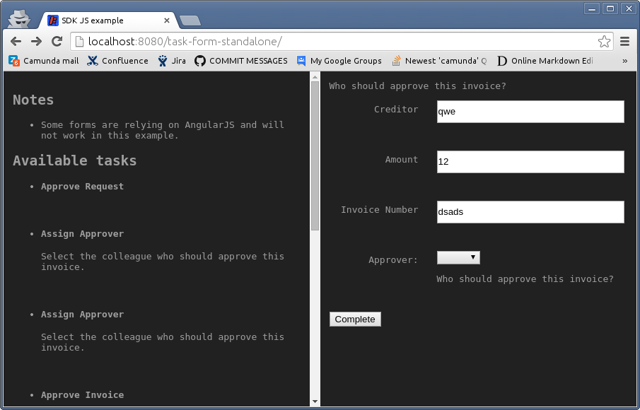

# Standalone usage of JS SDK

This example attempts to illustrate the way to implement (or use) the [JS SDK](https://github.com/camunda/camunda-bpm-sdk-js) to work with user task forms.



Supported browsers are:
- Firefox
- Google Chrome
- Internet Explorer 9+

## Setup

As you can see in the `index.html` of this folder, you will need a DOM library (jQuery in this example) and the Javascript SDK to start.

```html
<script src="./jquery-1.11.2.js"
      type="text/javascript"></script>

<script src="./camunda-bpm-sdk.js"
      type="text/javascript"></script>
```

## Script

Note: you can find the complete code of this example in the `scripts.js` file.

### Client

The form SDK utilizes an instance of the CamSDK.Client to communicate with the engine (over the [REST API](http://docs.camunda.org/latest/api-references/rest/)):

```js
var camClient = new CamSDK.Client({
  mock: false,
  apiUri: '/engine-rest'
});

var taskService = new camClient.resource('task');
```

### Tasks

In this example, we do load the tasks using the client (as initialized above).

```js
taskService.list({}, function (err, results) {
  // the tasks information can be found as an array in
  // results._embedded.task
});
```

### Loading the form

To load the form, you will have to get its contextPath, which can be done like that

```js
taskService.form(taskId, function(err, taskFormInfo) {
  var url = taskFormInfo.key.replace('embedded:app:', taskFormInfo.contextPath + '/');
  // ...
});
```

and then

```js
new CamSDK.Form({
  client: camClient,
  
  // with the URL we build previously
  formUrl: url,
  
  // and the task ID
  taskId: taskId,
  
  // $formContainer can be a DOM element or a jQuery object
  containerElement: $formContainer,

  // you can pass a callback to continue logic execution when the form is ready
  // the callback, should have a `error, camFormInstance` signature
  done: callback
});
```

### Submitting the form

Submitting the form is straightforward, the instance of CamSDK.Form have a `submit` method who takes a single callback.

```js
camFormInstance.submit(function (err) {
  // do something with the (or, hopefully, the lack of) error
});
```


# Running this example

1. Clone the respository
2. Copy this folder to the `server/apache-tomcat-X.X.XX/webapps` directory of a [camunda BPM platform distribution](http://camunda.org/download/)
3. Start the platform
4. Go to http://localhost:8080/browser-forms and play around

Note: some forms might not work in this example because they require Angular.js
