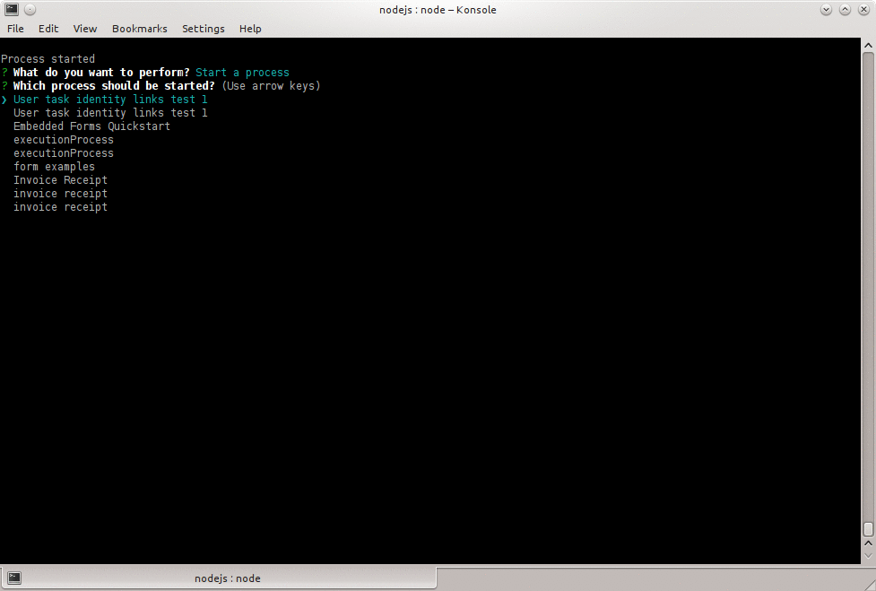

# Node.js usage of JS SDK

This example attempts to illustrate the useage of the [JS SDK](https://github.com/camunda/camunda-bpm-sdk-js) in a [node.js](http://nodejs.org) environement.

The [`index.js`](./index.js) file of this directory should be clear enough to give you an idea of how to implement the SDK in your node.js applications.

# Running this example

You will need to install [node.js](http://nodejs.org) to run this example and then:

1. Clone the respository
2. Start a [camunda BPM platform distribution](http://camunda.org/download/)
3. Go to the directory of this example
4. Install the dependencies with `npm install`
5. Run the example with `node index.js`

__Note:__ If you want to start a process:

1. Select "Deploy process"
2. Set a name for your deployment (`weodihx7` is __OK__)
3. Answer a few things
4. When asked "In which directory the files to be deployed?", press "enter"   
   (or give the full path to a directory containing BPMN files)
5. Select "Working.bpmn" (if you pressed "enter" at previous step)
