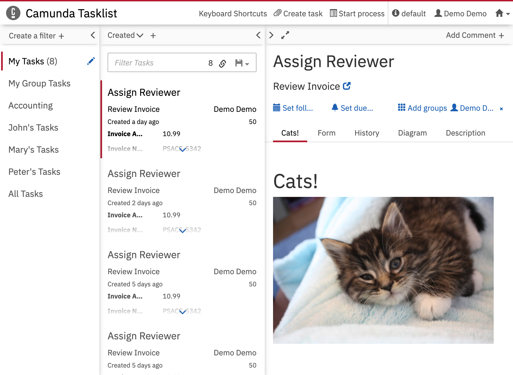

Javascript Only Plugin for Camunda Tasklist
=================================

This example shows how to develop a Tasklist plugin without the need to register it with the Camunda Platform server. It makes use of the `customScript` property of the webapp configurations.

Built and tested against Camunda Platform version `7.15.0`.




Integrate into Camunda Webapp
-----------------------------

Copy the `cats.js` file into the `app/tasklist/scripts/` folder in your Camunda webapp distribution. For the Tomcat distribution, this would be `server/apache-tomcat-X.X.XX/webapps/camunda/app/tasklist/scripts/`.

Add the following content to the `customScripts` object in the `app/tasklist/scripts/config.js` file:

```
  // …
  customScripts: [
    'scripts/cats'
  ],
  // …
```

License
-------

Use under terms of the [Apache License, Version 2.0](http://www.apache.org/licenses/LICENSE-2.0)
