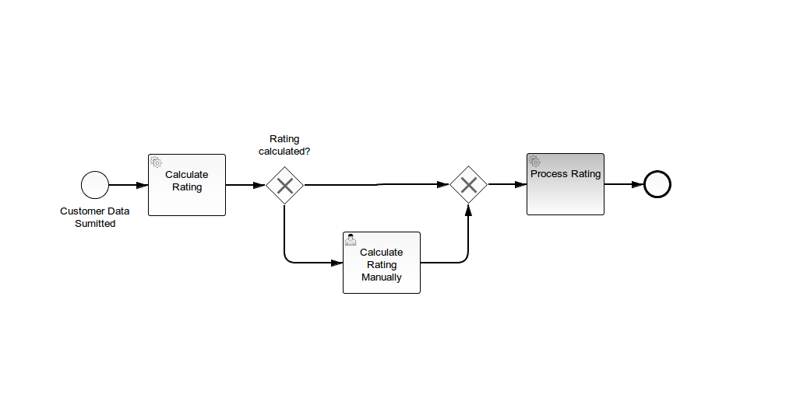

# Serialized Objects in Embedded Forms

This example demonstrates how to work with serialized Java objects in embedded forms.

## The BPMN Process used in this example



The process is kicked off by a form where the user is supposed to provide data about a customer.
The process then attempts to calculate a rating using a Java Class. If the rating cannot be
calculated automatically, a usertask is created and the user has to calculate the rating manually.

## Modeling data as Java Objects

Customer data is modeled using a Java Class:

```java
public class CustomerData {

  protected String firstname;
  protected String lastname;
  protected boolean isVip;
  protected float rating;
  protected List<Address> addresses = new ArrayList<Address>();

  // ... getters / setters omitted
}
```

The `CustomerData` class provides a collection of addresses. Addresses are modeled like this:

```java
public class Address {

  protected String street;
  protected String zipCode;
  protected String city;
  protected String country;

  // ... getters / setters omitted
}
```

## Creating a Java Object Variable in a Start Form

The process instance is started using a form. The form is a plain HTML form which is displayed
inside Camunda Tasklist (or inside a custom application using the camunda-bpm-sdk-js library).

```html
<form name="customerForm" role="form">

  <script cam-script type="text/form-script">

    // angular form works on scope object
    var customerData = $scope.customerData = {
      addresses : []
    };

    // hook into camunda SDK JS Form Lifecycle
    camForm.on('form-loaded', function() {

      // declare variable 'customerData' incuding metadata for serialization
      camForm.variableManager.createVariable({
        name: 'customerData',
        type: 'Object',
        value: customerData,
        valueInfo: {
          // indicate that object is serialized as json
          serializationDataFormat: 'application/json',
          // provide classname of java object
          objectTypeName: 'org.camunda.bpm.example.usertask.embedded.serialized.model.CustomerData'
        }
      });

    });

  </script>

  <h3>Customer Data</h3>

  <div class="control-group">
    <label class="control-label" for="firstname">Firstname</label>
    <div class="controls">
      <input id="firstname"
             class="form-control"
             type="text"
             required 
             ng-model="customerData.firstname">
    </div>

  <!-- ... Additional fields ommitted -->

  </div>
</form>
```

The custom java script creates a Javascript Object and binds it to the angular `$scope` of the form
as a variable named `customerData`. We then hook into the lifecycle of camunda SDK JS Form and
create a process variable named `customerData` and provide additional type information and metadata
used for serialization. The Object should be serialized as "application/json" and the type of the
object is `org.camunda.bpm.example.usertask.embedded.serialized.model.CustomerData`.

The form itself is a plain angular js form (see `ng-model` binding of input field).


## Accessing the Object Variable

In a Java Delegate, the `customerData` variable can be retrieved in the regular way:

```java

public class CalculateRating implements JavaDelegate {

  public void execute(DelegateExecution execution) throws Exception {

    CustomerData customerData = (CustomerData) execution.getVariable("customerData");

    // ...
  }
}
```

## Accessing an existing Java Object Variable in a Task Form

In a task form, an existing Java Object variable can be accessed using custom Javascript. The
pattern is to first fetch the value of the variable and then bind it to an angular scope variable:


```javascript
camForm.on('form-loaded', function() {
  // fetch the variable named 'customerData'
  camForm.variableManager.fetchVariable('customerData');
});

camForm.on('variables-fetched', function() {
  // after the variables are fetched, bind the value of customerData to a angular
  // scope value such that the form can work on it
  $scope.customerData = camForm.variableManager.variable('customerData').value;
});
```

## Running the example

1. [Download a Camunda BPM Distribution](http://camunda.org/download)
2. Checkout this repository using Git
3. Build the example using `mvn clean package`
4. Deploy the `.war` file located in the `target/` folder to the server
5. Open Camunda Tasklist using the URL [http://localhost:8080/camunda/app/tasklist](http://localhost:8080/camunda/app/tasklist)
6. Start a new instance of the Process.


